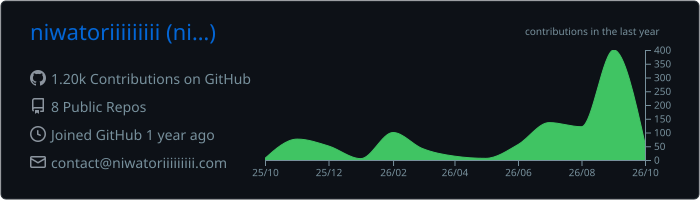
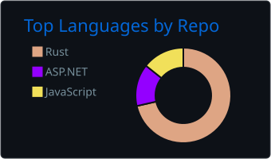
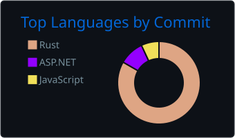
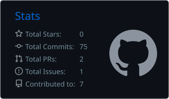
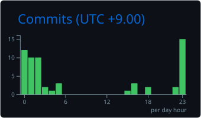

# Hello, World! 🐔

- 🌱 I’m currently learning ... Rust, C++, AtCoder
- 🤔 I’m looking for help with ... Rust, AtCoder
- 💤 **No sleep, no life**

## 🛠️ Tech Stack

**🔧 Languages** 

 

**💻 Tools** 

 

## 📊 GitHub Stats 

   

  
   

  
  

## Others 

