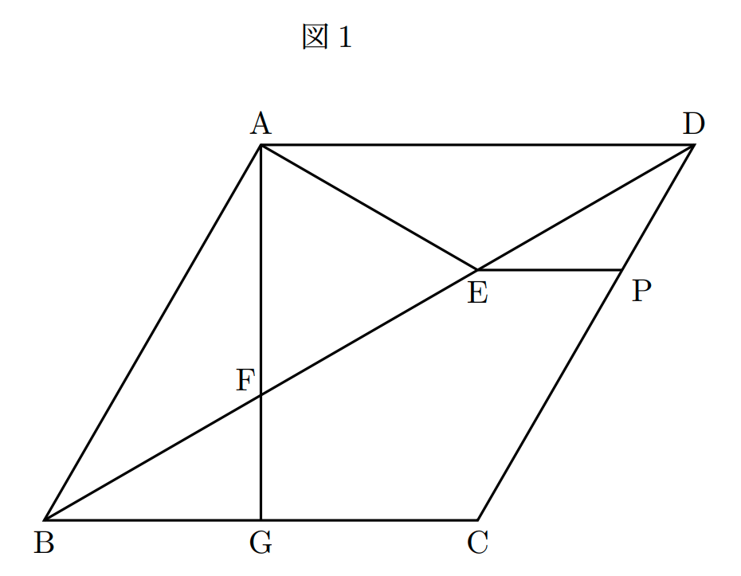
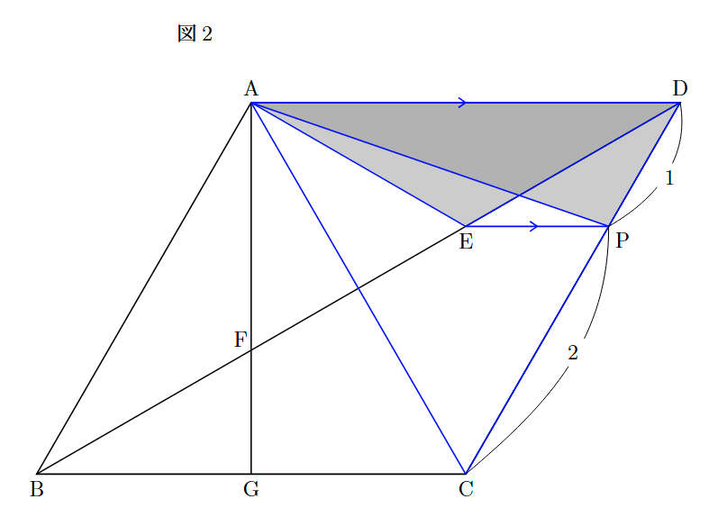
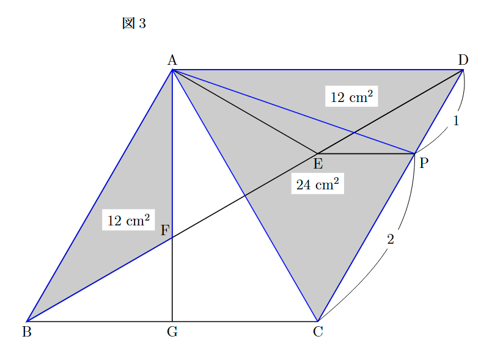

## 作問した問題

平面図形の問題を作問しました。
以下のGoogleドライブからPDFをダウンロードして挑戦してみてください。

&nbsp;

[問題と解答](https://drive.google.com/drive/folders/15Ohovq4vfMHWzBGSwB1G-G0QqPhPIPrU?usp=sharing)

---

### 1. 問題

下の $\text{図1}$ において，四角形 $\text{ABCD}$ はひし形であり,
辺 $\text{BC}$ 上に点 $\text{G}$ を $\text{AG} \perp \text{BC}$ となるようにとり，線分 $\text{AG}$ と対角線 $\text{BD}$ との交点を $\text{F}$ とする。
また，対角線 $\text{BD}$ 上に点 $\text{E}$ を $\angle\text{BAE} = 90^\circ$ となるようにとる。
さらに, 辺 $\text{EP}$ と辺 $\text{BC}$ が平行となるような点 $\text{P}$ を辺 $\text{CD}$ 上にとる。

このとき, 次の問いに答えなさい。

&nbsp;

(1) $\triangle\text{ABF}$ と $\triangle\text{ADE}$ が合同であることを証明しなさい。

(2) ひし形 $\text{ABCD}$ の面積が $72 \text{ cm}^{2}$, $\text{CP}:\text{PD}$ が $2:1$ であるとき, 三角形 $\text{ABF}$ の面積を求めよ。

【問題は以上です。】

---

### 2. 解答・解説

【ここからは解答です。】

&ensp;

#### (1) 合同の証明

【答え】

&nbsp;

$\triangle ABF$ と $\triangle ADE$ において,

四角形 $ABCD$ はひし形だから, すべての辺の長さは等しい。
$$AB = AD \quad \cdots \text{①}$$
$\triangle ABD$ は $AB = AD$ の二等辺三角形だから, 底角は等しい。
$$\angle ABF = \angle ADE \quad \cdots \text{②}$$
また, 仮定より $\angle BAE = 90^{\circ}$ だから,
$$\angle BAF + \angle EAF = 90^{\circ}$$
これより,
$$\angle BAF = 90^{\circ} - \angle EAF \quad \cdots \text{③}$$
同様に, $\text{AF} \perp \text{AD}$ より, $\angle DAF = 90^{\circ}$ であるため,
$$\angle DAE = 90^{\circ} - \angle EAF \quad \cdots \text{④}$$
③, ④より,
$$\angle BAF = \angle DAE \quad \cdots \text{⑤}$$

①, ②, ⑤より, 1組の辺とその両端の角がそれぞれ等しいので,
$$\triangle ABF \equiv \triangle ADE$$

#### (2) 面積の計算

(1)より, $\triangle ABF \equiv \triangle ADE$ なので, $\triangle ADE$ の面積を求めればよいです。

ここで, 仮定より $EP \parallel BC$（すなわち $EP \parallel AD$）なので, 等積変形によって点 $E$ を $EP$ に沿って移動させても, 三角形の面積は変わりません。

したがって, $\triangle ADE$ の面積は, 点 $E$ を 点 $P$ まで移動させた $\triangle ADP$ の面積と等しくなります。$\text{(図2)}$

$$
\triangle ADE = \triangle ADP
$$

ひし形 $ABCD$ の面積は $72\text{ cm}^2$ なので、対角線で分けた $\triangle ACD$ の面積はその半分です。
$$
\triangle ACD = 72 \times \frac{1}{2} = 36\text{ cm}^2
$$

また、仮定より $CP : PD = 2 : 1$ なので、底辺の長さの比から $\triangle ADP$ の面積は $\triangle ACD$ の $\frac{1}{3}$ になります。$\text{(図3)}$

$$
\triangle ABF = \triangle ADE = \triangle ADP = 36 \times \frac{1}{3} = 12\text{ cm}^2
$$

【答え】
$$12\text{ cm}^2$$

---

お疲れさまでした！

もし問題に不備などを見つけた場合は、にわとりの[Gmail](mailto:niwatori0xd2b48c@gmail.com)までお知らせください。（多分直さないけど）
